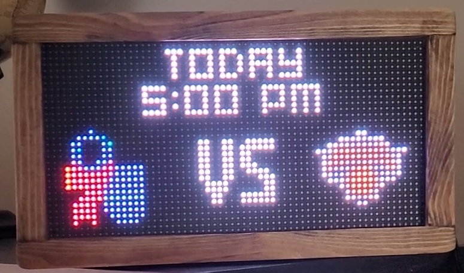
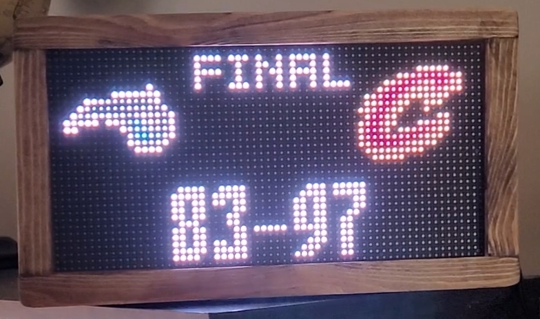

# all-sport-scoreboard

Display your favorite team's scores on an raspberry pi powered LED matrix. Currently the code has NFL, MLB, NBA, NHL, NCAA Football and Basketball. Currently supports 64x32 boards only.

### Credit and inpsiration
I got an ad on social media for a small LED scoreboard and thought it was pretty neat but was turned off by their high price tag. Then I started Googling DIY versions and low and behold there were a lot of them! I forked [nfl-led-scoreboard](https://github.com/mikemountain/nfl-led-scoreboard) and took its code base and started making updates. Looks like he was inspired by the [nhl-led-scoreboard](https://github.com/riffnshred/nhl-led-scoreboard), who based THEIR project off of the [mlb-led-scoreboard](https://github.com/MLB-LED-Scoreboard/mlb-led-scoreboard). So go check them out too if you want a specific sport, but this one supports many.

## Displays

### Logos
I followed this [guide](https://learn.adafruit.com/led-matrix-sports-scoreboard/prep-the-team-logos) to collect all the team's logos.  I updated their script a little bit to not "reprocess" the files to small .bmp files. I kept them as 500x500 .png files.

I had trouble collecting the NCAA teams though because the ESPN API limited its response to 50 teams. I tried (not too hard) to add pagination to my request call but was unsuccessful so I wrote a small PowerShell [script](./ncaa.ps1) to collect team names and their IDs. I added them to a JSON [blob](./ncaa.json) to loop through to collect their logos with this [script](./ncaa_logos.py).

### Pregame
Currently shows the team logos and the game time. 

### Live scoring updates 
The score updates every 3 seconds.
- MLB games include the team's logos, the count with red, green, and blue dots, and the bases indicate runners on. [mlb-image](imgs/MLB_mid_game.jpg)
- NBA, NCAA Basketball, NHL games display the team's logos, scores, time and period. [basketball-image](imgs/NBA_mid_game.jpg)
- NFL and NCAA Football should do what MikeMountain's scoreboard does, but being that we're not in season I haven't been able to validate it yet.  Coming this fall!

### Postgame
Just kind of looks like the pre-game screen but with the final scores. 

### Postponed
Mostly for MLB, but I added a PPD display with a rain cloud for when games are postponed. 

## Roadmap

Future plans include:
* Updating the config.json to include Fav Teams from all sports.
* better logic in some places especially around the MLB count and bases.
- I'm not a programmer, I know some basic coding practices to get this thing cobbled together so feel free to put PRs out there to optimize the code.

## Installation
### Hardware Assembly
The [mlb-led-scoreboard guys made a great wiki page to cover the hardware part of the project](https://github.com/MLB-LED-Scoreboard/mlb-led-scoreboard/wiki). There's also this [very handy howchoo page](https://howchoo.com/g/otvjnwy4mji/diy-raspberry-pi-nhl-scoreboard-led-panel) which is what I mainly followed.

### Software Installation
#### Raspbian Distribution
It is recommended you install the Lite version of Raspbian from the [Raspbian Downloads Page](https://www.raspberrypi.org/downloads/raspbian/). This version lacks a GUI, allowing your Pi to dedicate more system resources to drawing the screen.
**Make sure to set the timezone to your local timezone!**

#### Requirements
You need Git for cloning this repo and PIP for installing the scoreboard software.
```
sudo apt-get update
sudo apt-get install git python-pip
```

#### Installing the software
You can probably use the include install.sh like MountainMike does, but it wasn't working for me so I walked through his script manually and ended up doing the following to get things to work.

```
git clone --recursive https://github.com/jarvin521/all-sport-scoreboard.git
git clone https://github.com/hzeller/rpi-rgb-led-matrix.git matrix
cd matrix
make build-python
apt-get install python3-pip
pip install rgbmatrix
pip install RGBMatrixEmulator
pip install requests
pip install tzlocal
pip install pytz
```
[rpi-rgb-led-matrix](https://github.com/hzeller/rpi-rgb-led-matrix/tree/master/bindings/python#building): The open-source library that allows the Raspberry Pi to render on the LED matrix.

[requests](https://requests.kennethreitz.org/en/master/): To call the API and manipulate the received data.

## Testing & Optimization (IMPORTANT)
If you have used a LED matrix on a raspberry pi before and know how to run it properly, then you can skip this part. 

If you just bought your LED matrix and want to run this software right away, reference the [rpi-rgb-led-matrix library](https://github.com/hzeller/rpi-rgb-led-matrix/). Check out the section that uses the python bindings and run some of their examples on your screen. For sure you will face some issues at first, but don't worry, more than likely there's a solution you can find in their troubleshooting section.
Once you found out how to make it run smoothly, come back here and do what's next.

Before my LED Matrix was delivered I did some testing with the `RGBMatrixEmulator`[module](https://github.com/ty-porter/RGBMatrixEmulator).  This allowed me to write and test code that just popped a window on my laptop and displayed an digital LED matrix.  It was super helpful, so thank you ty-porter for that!

### Adafruit HAT/bonnet
If you are using any thing from raspberry pi 3+ to the newest versions with an Adafruit HAT or Bonnet, here's what [RiffnShred](https://github.com/riffnshred) did to run his board properly. It seems these are more recommendations than things you 100% absolutely need to do, but are probably beneficial anyway.

I'm using a raspberry pi 2 model 3 with a USB wifi adapter. I bought the Adafruit Hat and LED Matrix listed in the howchoo "What You'll Need" section. I bought a 4mm pitch matrix, however.

* Do the hardware mod found in the [Improving flicker section ](https://github.com/hzeller/rpi-rgb-led-matrix#improving-flicker). This made a huge difference for me, highly recommend it!
* Disable the on-board sound. You can find how to do it from the [Troubleshooting sections](https://github.com/hzeller/rpi-rgb-led-matrix#troubleshooting). I don't think you have a choice with this anymore.  My scoreboard wouldn't start and returned an error stating the on-board sound was still enabled. (Sorry, I should've grabbed a pic of this but didn't. Just follow the steps above.)
* From the same section, run the command that remove the bluetooth firmware, unless you use any bluetooth device with your pi.

Finally, here's the command he used.
```
sudo python main.py --led-gpio-mapping=adafruit-hat-pwm --led-brightness=60 --led-slowdown-gpio=2
```

## Usage
Open `/data/game_parser.py` and in the main fuction there are a bunch of loops and if statements. Add your favorite teams in the corresponding sports loop.  Just add a space `" "` to collect all teams. I'm hopefully going to improve this section soon!

Now, in a terminal, cd to the nfl-led-scoreboard folder and run this command. 
```
sudo python main.py 
```
**If you run your screen on an Adafruit HAT or Bonnet, you need to supply this flag.**
```
sudo python main.py --led-gpio-mapping=adafruit-hat-pwm --led-brightness=20 --led-slowdown-gpio=4
```

### Flags
Use the same flags used in the [rpi-rgb-led-matrix](https://github.com/hzeller/rpi-rgb-led-matrix/) library to configure your screen.
```
--led-rows                Display rows. 16 for 16x32, 32 for 32x32. (Default: 32)
--led-cols                Panel columns. Typically 32 or 64. (Default: 32)
--led-chain               Daisy-chained boards. (Default: 1)
--led-parallel            For Plus-models or RPi2: parallel chains. 1..3. (Default: 1)
--led-pwm-bits            Bits used for PWM. Range 1..11. (Default: 11)
--led-brightness          Sets brightness level. Range: 1..100. (Default: 100)
--led-gpio-mapping        Hardware Mapping: regular, adafruit-hat, adafruit-hat-pwm
--led-scan-mode           Progressive or interlaced scan. 0 = Progressive, 1 = Interlaced. (Default: 1)
--led-pwm-lsb-nanosecond  Base time-unit for the on-time in the lowest significant bit in nanoseconds. (Default: 130)
--led-show-refresh        Shows the current refresh rate of the LED panel.
--led-slowdown-gpio       Slow down writing to GPIO. Range: 0..4. (Default: 1)
--led-no-hardware-pulse   Don't use hardware pin-pulse generation.
--led-rgb-sequence        Switch if your matrix has led colors swapped. (Default: RGB)
--led-pixel-mapper        Apply pixel mappers. e.g Rotate:90, U-mapper
--led-row-addr-type       0 = default; 1 = AB-addressed panels. (Default: 0)
--led-multiplexing        Multiplexing type: 0 = direct; 1 = strip; 2 = checker; 3 = spiral; 4 = Z-strip; 5 = ZnMirrorZStripe; 6 = coreman; 7 = Kaler2Scan; 8 = ZStripeUneven. (Default: 0)
```

## Licensing
This project uses the GNU General Public License v3.0. If you intend to sell these, the code must remain open source and you at least have to tell people how cool I am (please, I need this).
